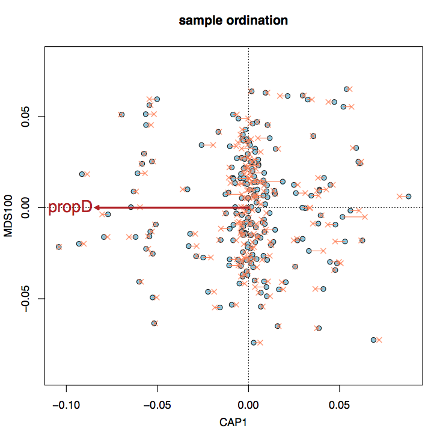

# Multivariate GWAS 
## based on constrained ordination

### Advantages:
- leverages existing SNP covariance structure to detect polygenic signals
- any number of covariates can be removed without loss of power
- naturally generates empirical null distribution to detect true signal and calculate p-values
- several correlated traits can be used together as a "compound trait"

The key script here is **RDA_GWAS.R**. Below is the "help" page it would print if run without any arguments. The genotype file needed to run these, *chr14.postAlleles.gz*, is here: https://www.dropbox.com/s/12oi4dmfep7meup/chr14.postAlleles.gz . 

This project is based on the idea of using constrained ordination to look for genotype-environment associations, presented in papers by Brenna R. Forester et al: 
https://doi.org/10.1111/mec.13476
https://doi.org/10.1111/mec.14584

#### RDA_GWAS.R: Arguments (things we need to run this method)
> **Note:** all tables must be space-delimited, and can be compressed .gz files.

**gt=[filename]** Genotypes: table of minor allele counts (rows - loci, columns - samples) the first two columns must be chromosome, position header line must be present (chr, pos, sample names). Better have multiple genotype tables, split by chromosome, to run things with less memory and in parallel.

**covars=[filename]**  Table of covariates to use (rows - samples, columns - covariates). First column must be sample names. Header line must be present (sample, covariates). May not fully match the genotype table. Rows containing NA will be removed.

**traits=[filename]** Table of trait(s). First column must be sample names. There must be at least 2 columns (samples, 1 trait). Header line must be present (sample, traits). May not fully match the genotype table. Rows containing NAs will be removed.

**gdist=[filename]** Matrix of genetic distances between samples listed in the genotype file (e.g. IBS matrix from angsd). No header line or other non-numeric columns.

**gdist.samples=[filename]** Single-column list of sample names *exactly corresponding* to the genotype AND genetic distances matrix. Could be filenames with leading path and trailing extension (these will be removed) - basically use the same file that was used for -b argument in angsd to obtain IBS matrix and genotypes.

**hold.out=[filename]**  File listing sample names to hold out from the whole analysis for subsequent testing. Omit this if working with all samples

#### other RDA_GWAS.R arguments

**outfile=[filename]**  Output file name.

**plots=TRUE** Whether to plot fun plots ([outfile]_plots.pdf).

**nsites=5500000** Number of sites to compute FDR (for Manhattan plot).

**prune.dist=50000** Pruning distance (chosen SNPs must be at least that far apart).

**Output or RDA_GWAS.R:**   RData bundle containing results table for pruned SNPs (*out*) with zscores, pvalues, betas and R2s, their genotypes (*gt.s*), genotypes of the test sample set (*gt.test*), sample scores for the trait (*sample.scores* - not including the hold-out samples), and Manhattan plot data for all sites (*manh*).

## Simple run, for a whole dataset (without hold-out samples) ## 
 
```bash
# Assuming we have multiple *.postAlleles.gz files with genotypes, one file per chromosome

>allchroms
for CHR in `ls *postAlleles.gz`; do
# remove everything from the file name after the first non-alphanumeric character, to get neater output names
OUTN=`echo $CHR | perl -pe 's/^([\w\d]+)\\..+/$1/'`;
echo "Rscript RDA_GWAS.R gt=$CHR covars=mds2 traits=pd.traits gdist.samples=bams.qc gdist=zz8.ibsMat outfile=${OUTN}_pd.RData">>allchroms;
done
```
Execute all commands in *allchroms* (preferably in parallel)

This will generate RData bundles, one for each chromosome, containing the following R objects:
* *out* : results table for pruned SNPs containing zscores, pvalues, betas (for simple linear model and elastic net regression), and r-squares for lm regressions;
* *gt.s* : genotypes of chosen SNPs;
* *gt.test* : genotypes of hold-out samples (if any) at the selected SNPs;
* *manh* : manhattan plot data (zscores, pvalues) for ALL analyzed sites;
* *sample.scores* : sample scores along the first constrained ordination axis.

Also, unless *plots=FALSE* option is given, there will be *_plots.pdf* files generated for each chromosome, containing the following plots:


* constrained ordination plot for samples, and the trait(s) vector(s). The analysis uses sample scores along the first constrained axis, CAP1, but multiple correlated traits can be used to define it.


* q-q plot of SNP scores along CAP1 compared to SNP scores along a very high-order MDS representing noise. Departure upwards from the red line at the top right corner indicates positive signal, departure downwards in the lower left corner - negative signal.


* SNP scored in the same ordination space: CAP1 (trait) vs MDS150 (noise). Colored rings are increasing z-scores. The idea is to check if the cloud is more extended / has more outliers along CAP1 compared to MDS150.


* Manhattan plot of all analyzed sites. Adjusted p-values are supposed to be genome-wide, if the total number of analyzed SNPs (across the whole genome) is supplied to *RDA_GWAS.R* as *nsites=1234567* argument.


* Manhattan plot for distace-pruned top-zscore SNPs. Pruning follows the same procedure as LD-pruning but with distances instead of LD (LD stuff is currently in the works). In short, the top z-score SNP is chosen first, then the next one is the one that has highest z-score at least *prune.dist* away from the first one, and so on. *prune.dist* is the argument to *RDA_GWAS.R*, default is 50000.

To compile all chromosomes together and plot genome-wide manhattan plot (only uses contigs with "chr" in the name!):
```bash
ls *_pd.RData >pds
Rscript compile_chromosomes.R in=pds
```
## Run with hold-out samples ##
This is a bit more involved. First, we need to list hold-out sample names in a file. We might wish to make many such files listing randomly picked hold-out samples. So we will have a bunch of sample-listing files named, for example, *rep25_10* - which would be 25th replicate of witholding 10 samples. We might also need to make replicate-specific tables of covariates, especially if they include unconstrained MDSes - those we are supposed to compute based on the dataset *without the hold-out samples*. See *write_holdout_reps.R* for example R code (spagetty warning). 

Then we basically need to run the above code for each of the replicates, with additional hold.out=[filename] argument to *RDA_GWAS.R* . Here is one way to do this with bash looping. Note that in this case we are setting up a run with 50 hold-out replicates, with replicate-specific covariate files named like *mds2_25_10* (to correspond with the hold-out samples filenames like *rep25_10*). Note that we do NOT need to subset our genotypes, genetic distances, or traits tables - this will happen automatically, just supply full files for all samples.

```bash
>pdd
for R in `seq 1 50`; do
REP=rep${R}_10;
MDS=mds2_${R}_10;
for CHR in `ls *postAlleles.gz`; do
OUTN=`echo $CHR | perl -pe 's/.+(chr\d+).+/$1/'`;
echo "Rscript RDA_GWAS.R gt=$CHR covars=$MDS traits=pd.traits gdist.samples=bams.qc plots=FALSE gdist=zz8.ibsMat hold.out=$REP outfile=${OUTN}_pd_${REP}.RData">>pdd;
done;
done
```
Executing all commands in *pdd* (much preferrably in parallel!) will give us 50 hold-out runs per each chromosome. To sort out this mess, first we need to compile results for all chromosomes for each hold-out replicate, using *compile_chromosomes.R*:
```bash
>compd
for r in `seq 1 50`; do
ls *pd_rep${r}_*.RData >rep${r}_pd; 
echo "Rscript compile_chromosomes.R in=rep${r}_pd plotManhattan=FALSE">>compd;
done
```
Executing all commands in *compd* gives us per-replicate, whole-genome results. Each output file includes genotypes for hold-out samples, not included in the main analysis. The last stage is to see how well the trait values in these samples are predicted based on their polygenic scores, and summarize the results of all replicates in a nice plot: 
```bash
ls rep*_pd.RData >reps50
compile_replicates.R in=reps50 traits=pd.traits
```
Note that we need to supply argument *traits* again, pointing to the same table as we were using for *RDA_GWAS.R*

This will generate a plot *reps50.pdf* looking somewhat like this:


Where:
* panel 1: scan through z-score cutoffs for best predictions (using lm betas)
* panel 2: predictions for hold-out samples based on lm betas
* panel 3: predictions based on regularized betas (glmnet)
* panel 4: comparison of simple and regularized predictions

## Appendix
#### How to get genotypes (posterior minor allele counts) and genetic distance matrix (IBS) from ANGSD

Assume we have a file *bams.qc* listing our (indexed) bam files, from which we have already tossed all the samples that are severely under-sequenced, clonal, wrong species, or just look weird a PCoA plot. We have already decided on the genotyping rate cutoff (-minInd argument to angsd), which is the number of individuals in which a locus must be represented by at least one read (idealy it shoudl eb set to 75-80% of total number of samples). We are going after variants of minor allele 0.05 and higher (-minMaf 0.05): 
```bash
FILTERS="-uniqueOnly 1 -remove_bads 1 -skipTriallelic 1 -minMapQ 30 -minQ 20 -dosnpstat 1 -doHWE 1 -maxHetFreq 0.5 -sb_pval 1e-5 -hetbias_pval 1e-5 -minInd 152 -snp_pval 1e-5 -minMaf 0.05 "
TODO="-doMajorMinor 1 -doMaf 1 -doCounts 1 -makeMatrix 1 -doIBS 1 -doGeno 8 -doPost 1"
angsd -b bams.qc -GL 1 $FILTERS $TODO -P 12 -out zz8
```
>If this runs out of memory, try reducing *-P* , all the way to *-P 1*.

The output file *zz8.ibsMat* is the genetic distances matrix (identity-by-state) that we can use for GWAS here. The file *zz8.geno.gz* contains posterior genotypes, but needs to be massaged a bit before we can use it.

First, let's unarchive it and split by chromosome:
```bash
zcat zz8.geno.gz | awk -F, 'BEGIN { FS = "\t" } ; {print > $1".split.geno"}'
```
If you have some short contigs in addition to chromosomes, you might wish to concatenate them together into a separate *unplaced.split.geno* file before proceeding. If your genome is highly fragmented, pre-concatenate it into "fake chromosomes" before mapping (see [concat_fasta.pl](https://github.com/z0on/2bRAD_denovo/blob/master/concatFasta.pl) ).

Now, we need to calculate posterior number of minor alleles:
```bash
>bychrom
for GF in *.split.geno; do
echo "awk '{ printf \$1\"\\t\"\$2; for(i=4; i<=NF-1; i=i+3) { i2=i+1; printf \"\\t\"\$i+2*\$i2} ; printf \"\\n\";}' $GF > ${GF/.split.geno/}.postAlleles" >>bychrom
done
```
Execute all lines in *bychrom*, and we got ourselves genotype data tables.

You might wish to compress them, for tidyness, although it is not necessary for *RDA_GWAS.R*:
```bash
for F in *.postAlleles;do gzip -f $F;done
```


Mikhail Matz, matz@utexas.edu, July 2020

