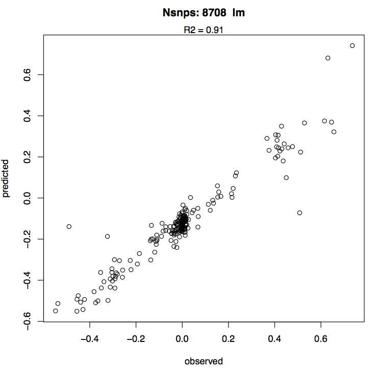

# Multivariate GWAS 
## based on constrained ordination

### Advantages:
- leverages natural SNP covariance structure to detect polygenic signals,
- naturally generates empirical null distribution to detect true signal and calculate p-values,
- any number of nuisance covariates can be removed without loss of power,
- several correlated traits can be used together as a "compound trait".

The key script here is **`RDA_GWAS.R`**, which is designed for command-line usage . 
The genotype file to run example code, `chr14.postAlleles.gz`, is here: https://www.dropbox.com/s/12oi4dmfep7meup/chr14.postAlleles.gz . 

### Installation ###
Simply clone the github repository and use R scripts as command-line programs (e.g., `Rscript RDA_GWAS.R [arguments]`), see details below. All bash code below assumes the repository was cloned into root directory; if not, make sure so change `~/Multivariate_GWAS/` to the actual path.

### *RDA_GWAS.R*: Main arguments (things we need to run this method)
> **Note:** all tables must be space-delimited, and can be compressed .gz files.

`gt=[filename]` Genotypes: table of minor allele counts in each sample (rows - loci, columns - samples). The first two columns must be chromosome, position. Header line must be present (chr, pos, sample names). I recommend running the method on `gt` files for individual chromosomes, to use less memory and to run it in parallel. (see **Appendix** about how to get this from **`angsd`**)

`covars.e=[filename]`  Table of NON-GENETIC covariates (e.g. sampling time, age of individual). These will be regressed out of traits. Rows - samples, columns - covariates. First column must be sample names. Header line must be present (sample, names of covariates). May not fully match the genotype table - the script will match them using the `sample` column. Rows containing NA will be removed.

`covars.g=[filename]`  Table of GENETIC covariates (e.g. sequencing batch, read depth, first couple of genetic PCs). These will be regressed out of genotypes. Same format as `covars.e`.

`traits=[filename]` Table of trait(s). First column must be sample names. There must be at least 2 columns (samples, 1 trait). Header line must be present (sample, names of traits). Just like `covars`, this table may not fully match the genotype table; rows containing NAs will be removed.

`gdist=[filename]` Matrix of genetic distances between samples listed in the genotype file (e.g. IBS matrix from **`angsd`**, see **Appendix**). Note: there must be no header line or other non-numeric columns.

`gdist.samples=[filename]` Single-column list of sample names *exactly corresponding* to the genotype AND genetic distances matrix. Could be filenames with leading path and trailing extension (these will be removed) - basically use the same file that was used for `-b` argument in **`angsd`** to obtain IBS matrix and genotypes (see **Appendix**).

`hold.out=[filename]`  File listing sample names to hold out from the whole analysis for subsequent testing of the polygenic score's prediction accuracy. May be omitted.

### Other optional *RDA_GWAS.R* arguments

`badsites=[filename]` List of sites to explude from analysis, in the format `chr1:12345` (one site per row).

`plots=TRUE` Whether to plot diagnostic plots (`[outfile]_plots.pdf`).

`nsites=5500000` Total number of sites *acros the whole genome* that are being analyzed - this is to compute genome-wide FDR (Benjamini-Hochberg method).

`prune.dist=25000` Pruning distance (selected SNPs must be at least that far apart). Alternatively, an RData bundle containing object *rdlm*, output of `LDq.R` script - distance to R2 dropoff below 0.1 for each point in the genome.

## Simple run, for a whole dataset (without hold-out samples) ## 
Assuming we have multiple `*.postAlleles.gz` files with genotypes, one file per chromosome:
```bash
>allchroms
for CHR in `ls *postAlleles.gz`; do
echo "Rscript ~/Multivariate_GWAS/RDA_GWAS.R gt=$CHR covars.e=reefsites covars.g=technical.covars traits=pd.traits gdist.samples=bams.qc gdist=zz8.ibsMat">>allchroms;
done
```
Execute all commands in `allchroms` (preferably in parallel)

This will generate RData files with extension `_gwas.RData`, one for each chromosome, containing `gwas` object, which is a dataframe for all analyzed SNPs containing zscores, pvalues, betas for ld-pruned SNPs (for simple linear model - *beta* - and elastic net regression - *beta.rr*), and r-squares for lm regressions. The second saved file - `traits_etc...RData` - contains information about traits and hold-out samples that will be needed to put the results for all chromosomes together.

Also, unless `plots=FALSE` option was given, there will be `_plots.pdf` files generated for each chromosome, containing the following plots:


* constrained ordination plot for samples, and the trait(s) vector(s). The analysis uses sample scores along the first constrained axis, CAP1, but multiple correlated traits can be used to define it. The coral-colored symbols are "linear combination" scores that are direct projectons of samples on the trait vectors, and light blue points are weighted average scores that take into account sample genotypes (these are actually used as the trait surrogate by the method). 
> Note: the metod always flips the CAP1 axis so that increase in the trait value (specifically, first column in the *traits* table) corresponds with increase of CAP1 score. Since CAP1 orientation is arbitrary, this does not change anything except making the results easier for a human to comprehend. The plot above is a raw plot, before flipping - the SNP ordination plot below (colored dots in rings) will be a flipped version of this one. 


* q-q plot of SNP scores along CAP1 compared to SNP scores along a very high-order MDS representing noise. Departure upwards from the red line at the top right corner indicates positive signal, departure downwards in the lower left corner - negative signal. In this case these is definitely some positive signal, but little or no negative signal.


* SNP scores in the same ordination space: CAP1 (trait) vs MDS100 (noise). Colored rings are increasing z-scores of distance from 0, the outmost ring is z > 5. The idea is to check if the cloud is more extended / has more outliers along CAP1 compared to MDS100 (which is clearly the case here).


* Manhattan plot of all analyzed sites. Adjusted p-values are supposed to be genome-wide, if the total number of analyzed SNPs (across the whole genome) was supplied to *RDA_GWAS.R* as *nsites=1234567* argument.


* Manhattan plot for distance-pruned top-zscore SNPs. Pruning follows the same procedure as LD-clumping: in short, out of SNPs with z-score exceeding 2, we choose the best-zscore SNP, remove all SNPs within `prune.dist` from it that have the same z-score sign, repeat for next-best remaining SNP, and so on. `prune.dist` is the argument to `RDA_GWAS.R`, default is 25000. Alternatively, instead of pruning baased on uniform distance, we can use position-specific distance at which the r-squared between SNPs drops below 0.1. Such data can be generated by the script `LDq.R` based on output of `ngsLD`(this is very beta though). 

  
* Change in trait prediction accuracy (Pearson's correlation between predicted and true trait values, based on `lm` predictions) when adding more SNPs, in order of decreasing zscores.  

  
* Predicted vs observed trait, using prediction from simple lm model.  


* Predicted vs observed trait, using prediction from regularized regression model.  
>**NOTE:** In this run, the last three plots are more like a sanity check rather than actual test of prediction power, because the trait is predicted **in the same samples** that were used to derive predictions. This always works too well! To check our prediction power properly, we must predict the trait in "hold-out" samples, that were NOT used for deriving predictions (see next section).

## To combine chromosomes together ##
Technically it is not necessary to run `RDA_GWAS.R` on indivdual chromosomes. It can properly handle mutiple chromosomes, but it will likely be very slow and run out of memory if given more than 2-3 chromosomes at once. Besides, splitting the task into individual chromosomes allows to run the analysis in parallel.

To combine all chromosomes together, there is a script `compile_chromosomes.R`. It will concatenate GWAS results for individual chromosome, rerun the elastic net regression and best-snp-number selection for lm-based preditions, and make predictions for the hold-out sample set (common to all per-chromosome analyses). If no hold-out set was specified, the predictions will be made about the whole dataset itself (just a sanity check, not the actual accuracy demonstration!). 

As input, `compile_chromosomes.R` needs two file-lists (text files listing file names): one for results of `RDA_GWAS.R` with extension `_gwas.RData`, and another for per-chromosome genotype files, same as used for `RDA_GWAS.R` (e.g., `chr1.postAlleles.gz`). It also needs a file called `traits_etc*.RData`, saved by `RDA_GWAS.R`, which contains information about traits and hold-out samples (argument `traits`), and a list of sample names (argument `gt.samples`) corresponding to the order of samples in genotype files (same as used in `RDA_GWAS.R`).

The example below first writes down the two file-lists and then runs `compile_chromosomes.R`:
```bash
ls chr*_gwas.RData >gws
ls chr*postAlleles.gz >gts
Rscript ~/Multivariate_GWAS/compile_chromosomes.R in=gws gts=gts gt.samples=bams.qc traits=traits_etc_0.RData
```
Additional options to `compile_chromosomes.R` are `runGLMnet=F` to suppress rerunning the elastic net regression and simply reuse per-chromosome betas, and `forceAlpha`, which must be the number between 0 and 1 and fixes the alpha parameter of the elastic net (by default the optimal alpha is determined based on hold-out sample set).

`compile_chromosomes.R` saves the combined gwas data table in `*_gwas.RData`. It also saves the table of two kinds of predictions: lm (linear model), rr (elastic net regression), and true trait values (after regressing out environmental covariates within `RDA_GWAS.R`) in `*_predictions.RData`.

## Runs with multiple hold-out replicates ##
To properly estimate prediction accuracy, we would want to run multiple analyses like the one described above, each time witholding some samples ("hold-out" samples), and then see how well we can predict the trait in those samples based on their genotypes. This sounds a bit tedious but not actually difficult with a bit of bash scripting. One simply need to repeat the above analysis 50 times for different hold-out sample sets, and then put together all the generated `*_predictions.RData`tables.

Assuming we have already created 50 files named like rep1_25, rep2_25 etc, each listing 25 randomly picked hold-out samples, we begin with running `RDA_GWAS.R`on each chromosome for each replicate:

```bash
>pdd
for R in `seq 1 50`; do
REP=rep${R}_25;
for CHR in `ls chr*postAlleles.gz`; do
echo "Rscript ~/Multivariate_GWAS/RDA_GWAS.R gt=$CHR covars.e=reefsites covars.g=technical.covars traits=pd.traits gdist.samples=bams.qc plots=FALSE gdist=zz8.ibsMat hold.out=$REP">>pdd;
done;
done
```
Execute all commands in `pdd`(definitely in parallel).

The next step is putting all chromosomes together, for each hold-out rep:

```bash
>compchrom
ls chr*postAlleles.gz >gts
for R in `seq 1 50`; do
REP=rep${R}_25;
ls chr*${REP}_gwas.RData >gws_${REP};
echo "Rscript ~/Multivariate_GWAS/compile_chromosomes.R in=gws_${REP} gts=gts gt.samples=bams.qc traits=traits_etc_${REP}.RData">>compchrom;
done
```
Finally, we need to fire up `R`, concatenate all dataframes from `*_predictions.RData` files, and plot the predictions against truth (example script is `combine_prediction_reps.R`, which is not a command-line kind of script):

  

## Where does it come from?
This project is based on the idea of using constrained ordination to look for genotype-environment associations, presented in papers by Brenna R. Forester et al: 
https://doi.org/10.1111/mec.13476 ; https://doi.org/10.1111/mec.14584


# Appendix
#### How to get genotypes (posterior minor allele counts) and genetic distance matrix (IBS) from ANGSD

Assume we have a file `bams.qc` listing our (indexed) bam files, from which we have already tossed all the samples that are severely under-sequenced, clonal, wrong species, or just look weird a PCoA plot. We have already decided on the genotyping rate cutoff (`-minInd` argument to `angsd`), which is the number of individuals in which a locus must be represented by at least one read (idealy it shoudl be set to 75-80% of total number of samples). We are going after variants of minor allele 0.05 and higher (`-minMaf 0.05`): 
```bash
REFERENCE=mygenome.fasta
FILTERS="-uniqueOnly 1 -remove_bads 1 -skipTriallelic 1 -minMapQ 30 -minQ 20 -dosnpstat 1 -doHWE 1 -maxHetFreq 0.5 -sb_pval 1e-5 -hetbias_pval 1e-5 -minInd 152 -snp_pval 1e-5 -minMaf 0.05 -rmTriallelic 1e-1 -anc $REFERENCE -ref $REFERENCE"
TODO="-doMajorMinor 1 -doMaf 1 -doCounts 1 -makeMatrix 1 -doIBS 1 -doGeno 8 -doPost 1"
angsd -b bams.qc -GL 1 $FILTERS $TODO -P 12 -out zz8
```
>If this runs out of memory, try reducing `-P` , all the way to `-P 1`.

The output file `zz8.ibsMat` is the genetic distances matrix (identity-by-state) that we can use for GWAS here. The file `zz8.geno.gz` contains posterior genotype probabilities, it needs to be massaged a bit before we can use it.

First, let's unarchive it and split by chromosome:
```bash
zcat zz8.geno.gz | awk -F, 'BEGIN { FS = "\t" } ; {print > $1".split.geno"}'
```
If you have some short contigs in addition to chromosomes, you might wish to concatenate them together into a separate `unplaced.split.geno` file before proceeding. If your genome is highly fragmented, pre-concatenate it into "fake chromosomes" before mapping (see [`concat_fasta.pl`](https://github.com/z0on/2bRAD_denovo/blob/master/concatFasta.pl)).

Then, we calculate posterior number of minor alleles:
```bash
>bychrom
for GF in *.split.geno; do
echo "awk '{ printf \$1\"\\t\"\$2; for(i=4; i<=NF-1; i=i+3) { i2=i+1; printf \"\\t\"\$i+2*\$i2} ; printf \"\\n\";}' $GF > ${GF/.split.geno/}.postAlleles" >>bychrom
done
```
Execute all lines in `bychrom`, and we got ourselves genotype data tables suitable for `RDA_GWAS.R`.

You might wish to compress them, for tidyness, although it is not necessary for `RDA_GWAS.R`:
```bash
for F in *.postAlleles;do gzip -f $F;done
```


Mikhail Matz, matz@utexas.edu, July 2020

